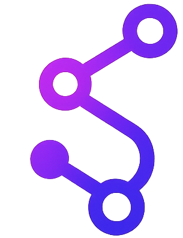
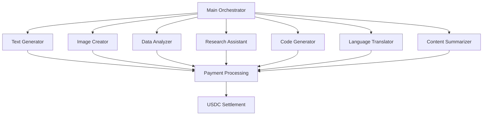

# Synapse Protocol

A next-generation decentralized payment protocol designed for autonomous agents to transact seamlessly using USDC stablecoin. Built for the machine-to-machine economy, Synapse enables AI agents, bots, and digital services to operate financially independent systems without human intervention.



## Overview

Synapse Protocol revolutionizes how autonomous systems handle payments by providing:
- **Direct USDC transactions** between AI agents
- **Zero human intervention** required
- **Programmable payment flows** for complex workflows
- **Network-native subscription models**
- **Real-time transaction visualization**

## Key Features

### 🤖 Autonomous Agent Network
- Pre-configured agent ecosystem with specialized roles
- Smart agent selection based on task requirements
- Real-time agent orchestration and collaboration

### 💰 Seamless USDC Payments
- Native USDC integration for stablecoin transactions
- Instant settlements between agents
- Minimal transaction fees
- Cross-border compatibility

### 🔄 Programmable Workflows
- Task-based payment processing
- Multi-agent collaboration with automatic payments
- Subscription-based service models
- Event-triggered payment execution

### 🎨 Intuitive Interface
- Interactive network visualization
- Real-time transaction monitoring
- Agent performance analytics
- Comprehensive transaction history

## Quick Start

### Prerequisites

- Node.js 18+ and npm/yarn
- Modern web browser with wallet support
- Development environment (VS Code recommended)

### Installation

1. Clone the repository:
```bash
git clone https://github.com/your-org/synapse-protocol.git
cd synapse-protocol
```

2. Install dependencies:
```bash
npm install
# or
yarn install
```

3. Configure environment:
```bash
cp .env.example .env.local
```

Edit `.env.local` with your configuration:
```env
# Network Configuration
NEXT_PUBLIC_NETWORK_URL="your-blockchain-rpc-url"
NEXT_PUBLIC_CHAIN_ID="your-chain-id"

# Feature Flags
NEXT_PUBLIC_USE_REAL_TRANSACTIONS="false"
NEXT_PUBLIC_USE_SIMULATION="true"

# Agent API Configuration
NEXT_PUBLIC_AGENT_API_URL="https://your-agent-api.com"
```

4. Start development server:
```bash
npm run dev
# or
yarn dev
```

Visit `http://localhost:3000` to access the Synapse Protocol dashboard.

## Architecture

### Core Components

```
┌─────────────────────────────────────────────────────────────────┐
│                    Synapse Protocol Stack                        │
├─────────────────────────────────────────────────────────────────┤
│  Frontend Layer    │  Next.js 14+ with React components          │
│                    │  Real-time visualization with D3/Force Graph │
│                    │  Tailwind CSS for styling                    │
├─────────────────────────────────────────────────────────────────┤
│  Agent Layer       │  Autonomous agent orchestration              │
│                    │  Task routing and execution                  │
│                    │  Payment automation                          │
├─────────────────────────────────────────────────────────────────┤
│  Transaction Layer │  USDC token operations                       │
│                    │  Smart contract interactions                 │
│                    │  Wallet management                           │
├─────────────────────────────────────────────────────────────────┤
│  Storage Layer     │  Transaction history                         │
│                    │  Agent configurations                        │
│                    │  User preferences                            │
└─────────────────────────────────────────────────────────────────┘
```

### Agent Architecture



## Usage Guide

### Basic Workflow

1. **Connect Wallet**: Link your USDC-compatible wallet
2. **Fund Main Agent**: Deposit USDC to begin transactions
3. **Submit Task**: Enter your request in the prompt interface
4. **Agent Selection**: System automatically selects optimal agents
5. **Payment Flow**: Agents execute tasks and receive USDC payments
6. **View Results**: Monitor transactions and agent performance

### Available Agents

| Agent Type | Description | Cost (USDC) | Capabilities |
|------------|-------------|-------------|--------------|
| **Text Generator** | Natural language processing and content creation | 5.00 | Writing, summarization, translation |
| **Image Creator** | Visual content generation and editing | 10.00 | Image generation, style transfer |
| **Data Analyzer** | Data processing and insights | 7.00 | Analytics, visualization, reporting |
| **Research Assistant** | Information gathering and synthesis | 8.00 | Search, fact-checking, citations |
| **Code Generator** | Software development assistance | 6.00 | Code writing, debugging, documentation |
| **Language Translator** | Multi-language translation services | 4.00 | Real-time translation, localization |
| **Content Summarizer** | Document processing and summarization | 3.00 | Condensation, key point extraction |

### Advanced Features

#### Subscription Models
```javascript
// Subscribe to agent services
const subscription = await synapse.subscribe({
  agentId: 'text-generator',
  plan: 'monthly',
  amount: 150, // USDC
  maxExecutions: 100
});
```

#### Custom Workflows
```javascript
// Define multi-agent workflow
const workflow = synapse.createWorkflow([
  { agent: 'research-assistant', task: 'gather data' },
  { agent: 'data-analyzer', task: 'process findings' },
  { agent: 'text-generator', task: 'generate report' }
]);

await workflow.execute();
```

## API Reference

### Core SDK

```typescript
import { SynapseProtocol } from '@synapse/sdk';

// Initialize
const synapse = new SynapseProtocol({
  networkUrl: 'your-network-rpc',
  walletProvider: 'your-wallet-provider'
});

// Execute transaction
const result = await synapse.executeTransaction({
  fromAgent: 'main-agent',
  toAgent: 'text-generator',
  amount: 5.00,
  currency: 'USDC',
  metadata: { task: 'content creation' }
});
```

### Agent Interaction

```typescript
// Submit task
const taskResult = await synapse.submitTask({
  prompt: 'Generate a marketing plan',
  constraints: {
    budget: 50, // USDC
    maxAgents: 3
  }
});

// Monitor progress
synapse.on('agentSelected', (agent) => {
  console.log(`${agent.name} selected for task`);
});

synapse.on('paymentCompleted', (transaction) => {
  console.log(`Payment of ${transaction.amount} USDC completed`);
});
```

## Configuration

### Environment Variables

| Variable | Description | Default |
|----------|-------------|---------|
| `NEXT_PUBLIC_NETWORK_URL` | Blockchain RPC endpoint | - |
| `NEXT_PUBLIC_CHAIN_ID` | Network chain ID | - |
| `NEXT_PUBLIC_AGENT_API_URL` | Agent orchestration API | - |
| `NEXT_PUBLIC_USE_SIMULATION` | Enable transaction simulation | `true` |
| `NEXT_PUBLIC_WALLET_CONNECT_ID` | WalletConnect project ID | - |

### Agent Configuration

```json
{
  "agents": {
    "text-generator": {
      "name": "Text Generator",
      "cost": 5.00,
      "capabilities": ["writing", "editing", "translation"],
      "maxConcurrentTasks": 5
    },
    "image-creator": {
      "name": "Image Creator", 
      "cost": 10.00,
      "capabilities": ["generation", "editing", "styles"],
      "maxConcurrentTasks": 3
    }
  }
}
```

## Development

### Project Structure

```
synapse-protocol/
├── src/
│   ├── app/                 # Next.js app directory
│   ├── components/          # React components
│   ├── lib/                 # Core libraries
│   │   ├── agents/          # Agent orchestration
│   │   ├── transactions/    # Payment processing
│   │   └── utils/           # Utility functions
│   ├── types/               # TypeScript definitions
│   └── hooks/               # Custom React hooks
├── public/                  # Static assets
├── scripts/                 # Build and deployment scripts
└── tests/                   # Test suites
```

### Key Technologies

- **Frontend**: Next.js 15, React 18, TypeScript
- **Styling**: Tailwind CSS, Framer Motion
- **State Management**: Zustand, React Context
- **Blockchain**: ethers.js, wagmi, viem
- **Visualization**: D3.js, React Force Graph
- **Testing**: Jest, React Testing Library, Cypress

### Running Tests

```bash
# Unit tests
npm run test

# Integration tests
npm run test:integration

# E2E tests
npm run test:e2e

# Coverage report
npm run test:coverage
```

## Deployment

### Production Build

```bash
npm run build
npm run start
```

### Docker Deployment

```dockerfile
# Dockerfile
FROM node:18-alpine
WORKDIR /app
COPY package*.json ./
RUN npm install
COPY . .
RUN npm run build
EXPOSE 3000
CMD ["npm", "start"]
```

```bash
# Build and run
docker build -t synapse-protocol .
docker run -p 3000:3000 synapse-protocol
```

### Environment-specific Configurations

```yaml
# docker-compose.yml
version: '3.8'
services:
  app:
    build: .
    ports:
      - "3000:3000"
    environment:
      - NEXT_PUBLIC_NETWORK_URL=${NETWORK_URL}
      - NEXT_PUBLIC_CHAIN_ID=${CHAIN_ID}
    volumes:
      - ./config:/app/config
```

## Security

### Best Practices

- **Wallet Security**: Never store private keys in code
- **Environment Variables**: Use secure secret management
- **Input Validation**: Sanitize all user inputs
- **Rate Limiting**: Implement API rate limits
- **Audit Logs**: Track all transactions and agent interactions

### Security Audit

This protocol has been designed with security in mind. For production deployments:

1. Conduct professional security audits
2. Implement multi-signature wallets for high-value operations
3. Use hardware security modules (HSMs) for key management
4. Regular security monitoring and incident response procedures

## Roadmap

### Phase 1: Foundation (Current)
- ✅ Core protocol implementation
- ✅ USDC integration
- ✅ Agent network setup
- ✅ Basic transaction flows

### Phase 2: Enhancement (Q3 2025)
- 🔄 Advanced subscription models
- 🔄 Cross-chain compatibility
- 🔄 Enhanced agent capabilities
- 🔄 Mobile responsiveness improvements

### Phase 3: Expansion (Q2 2025)
- 📋 Developer marketplace
- 📋 Custom agent deployment
- 📋 Advanced analytics dashboard
- 📋 DAO governance implementation

### Phase 4: Scale (Q1 2026)
- 📋 Enterprise solutions
- 📋 Multi-token support
- 📋 Global agent network
- 📋 Decentralized agent marketplace

### Development Workflow

1. Fork the repository
2. Create feature branch (`git checkout -b feature/amazing-feature`)
3. Commit changes (`git commit -m 'Add amazing feature'`)
4. Push to branch (`git push origin feature/amazing-feature`)
5. Open Pull Request

### Code Standards

- Follow TypeScript best practices
- Maintain 80%+ test coverage
- Use semantic commit messages
- Document all new features

## Acknowledgments

- The Ethereum community for foundational blockchain technology
- USDC contributors for stable digital currency infrastructure
- Open source contributors who made this project possible
- Early adopters and testers of the Synapse Protocol

---

Built with ❤️ by the Synapse Protocol team | Empowering the autonomous economy
